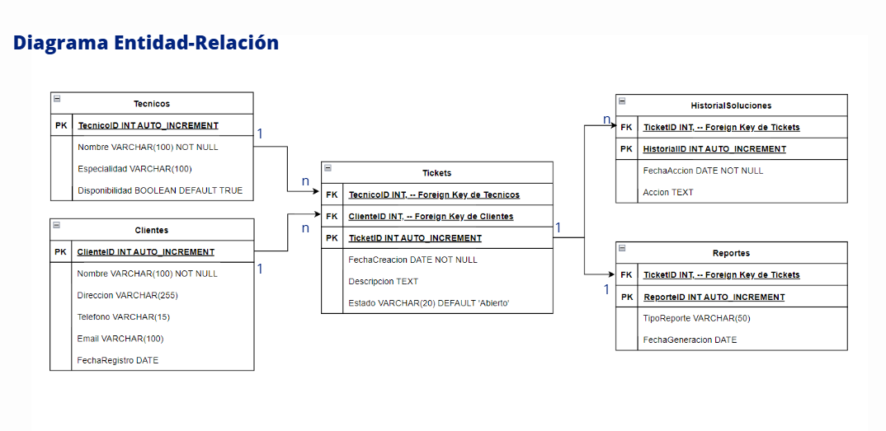

mini textito explicando antes 

mini texto explicando despues

(otra imagen)

Soporte Ticketera

6 queries:

0 - creacion login

1- base de datos: genera blablabla

1.5 - creacion usuarios

2 y 3- dos queries para insertar masivamente valores (ya sea por troubleshooting/para mostrar en una demo/x)

4- store procedure: queries para que programaticamente se ejecuten acciones prediseñadas sobre la base utilizando el codigo de negocio. en este caso, se genera las siguientes store procedure

1- actualizacion ticket
creacion ticket
creacion cliente
creacion tecnico

5- vistas para ejecutar consultas prediseñadas y optimizar el uso de recursos. Esto no se ejecuta a traves de un store procedure porque al hacer consultas no queremos exponenciar el tamaño de la base y consumir recursos.

6- consulta base: para consultar las bases.